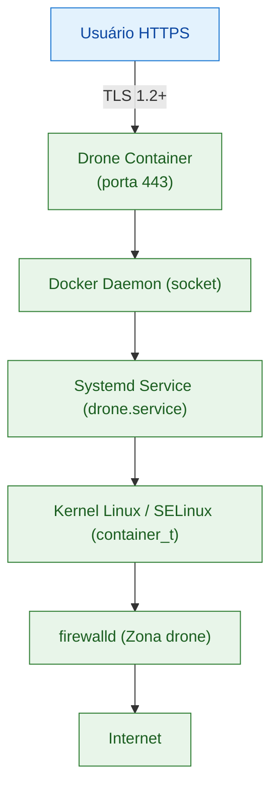
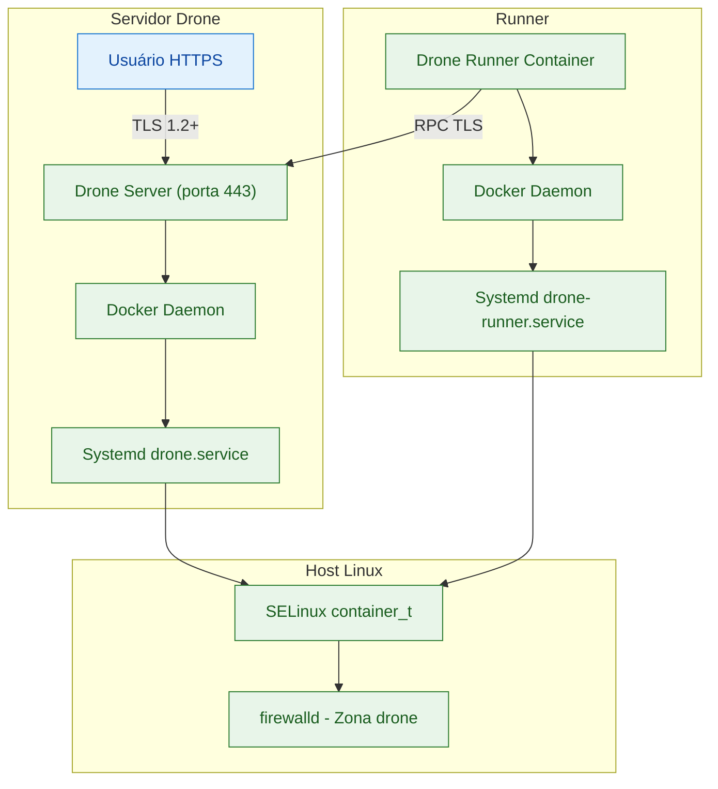

# droneci
Drone CI Server and Docker Runner - Installation and Configuration Best Practices for Hardened and Security in Depth


- Execução Segura de Aplicações Docker no Rocky Linux com SELinux (Modo Enforcing)
- Drone CI Server (`drone.example.com`) com TLS Direto
- Conformidade: NIST SP 800-53 Rev. 5 • PCI-DSS 4.0 • LGPD Art. 46–49

---
1. Introdução

Este documento define diretrizes para a **execução segura de containers Docker** da aplicação Drone CI Server em **Rocky Linux 9.x** com **SELinux em modo enforcing** e política _targeted_.

Objetivos:

- Implementar isolamento e resiliência operacional seguindo **NIST SP 800-53** (controles AC, SC, SI, AU, CM).
- Garantir conformidade com **PCI-DSS 4.0** (requisitos 1, 2, 6, 7, 10 e 11).
- Atender à **LGPD** (Lei 13.709/2018), Arts. 46 a 49.

---

2. Arquitetura de Referência



>**Defesa em profundidade:** 
>- o tráfego é filtrado pelo `firewalld`, 
>- o container é isolado pelo **Docker + SELinux**,
>- o serviço é controlado por um **Systemd** hardened.

---

3. Requisitos de Ambiente

```bash
sudo dnf update -y
sudo dnf install -y docker-ce docker-ce-cli containerd.io firewalld policycoreutils-python-utils
sudo systemctl enable --now docker firewalld
sudo setenforce 1
sestatus  # deve exibir "SELinux status: enforcing"
```

>**Conformidade:**
>- **NIST CM-6 / SI-2 (Flaw Remediation)** – manutenção de baseline seguro.
>- **PCI 6.2** – aplicação tempestiva de patches.
>- **LGPD Art. 46** – medidas técnicas de segurança.  

---

4. Criação de Usuário Dedicado e Diretórios

```bash
sudo useradd -r -s /sbin/nologin drone
sudo mkdir -p /srv/drone/data
sudo chown -R drone:drone /srv/drone
```

**Conformidade:**
>- **NIST AC-6 (Least Privilege)** – execução sob identidade restrita.
>- **PCI 7.1** – acesso mínimo necessário.
>- **LGPD Art. 49** – controle de acesso proporcional à finalidade.  

---

5. Política SELinux Personalizada

```bash
sudo semanage fcontext -a -t container_var_lib_t "/srv/drone(/.*)?"
sudo restorecon -Rv /srv/drone
sudo semanage port -a -t http_port_t -p tcp 80
sudo semanage port -a -t http_port_t -p tcp 443
```

>**Conformidade:**
>- **NIST SC-7 (Boundary Protection)** – isolamento lógico.  
>- **PCI 1.4** – segmentação de rede.  
>- **LGPD Art. 46** – proteção de dados pessoais.  
---

6. Configuração de Firewall (firewalld)

```bash
sudo firewall-cmd --permanent --new-zone=drone
sudo firewall-cmd --permanent --zone=drone --add-interface=docker0
sudo firewall-cmd --permanent --zone=drone --add-port=80/tcp
sudo firewall-cmd --permanent --zone=drone --add-port=443/tcp
sudo firewall-cmd --reload
sudo firewall-cmd --zone=drone --list-all
```

>**Conformidade:**
>- **NIST SP 800-41 Rev. 1 3.3** – defesa em profundidade.  
>- **PCI 1.2** – restrição de tráfego a serviços autorizados.  

---

7. Execução Segura do Container Drone

```bash
sudo tee /srv/drone/.env <<'EOF'
DRONE_SERVER_HOST=drone.example.com
DRONE_SERVER_PROTO=https
DRONE_RPC_SECRET=$(openssl rand -hex 16)
EOF
sudo chmod 600 /srv/drone/.env
sudo chown drone:drone /srv/drone/.env

sudo docker run -d \
  --name drone \
  --env-file /srv/drone/.env \
  --user $(id -u drone):$(id -g drone) \
  --cap-drop=ALL \
  --read-only \
  --tmpfs /tmp:rw,noexec,nosuid,size=64M \
  --volume /srv/drone/data:/data:Z \
  --restart unless-stopped \
  -p 80:80 -p 443:443 \
  drone/drone:2
```

>**Conformidade:**
>- **NIST SC-39 (Process Isolation)** / **AC-6** – contenção e privilégio mínimo.
>- **PCI 2.2.4** – serviços desnecessários desativados.
>- **LGPD Art. 46** – proteção no tratamento.

---

8. Unidade Systemd hardened (`/etc/systemd/system/drone.service`)

```bash
[Unit]
Description=Drone CI Server (Docker)
After=network.target docker.service
Requires=docker.service

[Service]
EnvironmentFile=-/srv/drone/.env
ExecStart=/usr/bin/docker start -a drone
ExecStop=/usr/bin/docker stop -t 30 drone
Restart=on-failure
RestartSec=5

User=drone
Group=drone
SupplementaryGroups=docker

PrivateTmp=yes
ProtectSystem=full
ProtectHome=yes
ProtectControlGroups=yes
ProtectKernelTunables=yes
ProtectKernelModules=yes
ProtectKernelLogs=yes
MemoryDenyWriteExecute=yes
ReadOnlyPaths=/usr /boot /etc
RestrictAddressFamilies=AF_INET AF_INET6 AF_UNIX
RestrictNamespaces=yes
RestrictRealtime=yes
RestrictSUIDSGID=yes
LockPersonality=yes
NoNewPrivileges=yes
CapabilityBoundingSet=CAP_NET_BIND_SERVICE
AmbientCapabilities=CAP_NET_BIND_SERVICE
SELinuxContext=system_u:system_r:container_t:s0
SystemCallFilter=@system-service
SystemCallArchitectures=native
StandardOutput=journal
StandardError=journal
TimeoutStopSec=30

[Install]
WantedBy=multi-user.target
```

>**Conformidade:**
>
>|Diretiva|Função|Controles|
>|---|---|---|
>|`User=drone`|Execução sem privilégios|**NIST AC-6 / PCI 7.1**|
>|`PrivateTmp=yes`|Isolamento de `/tmp`|**NIST SC-39 / PCI 2.2.4**|
>|`ProtectSystem=full`|`/usr`, `/etc` somente leitura|**NIST SC-7 / PCI 2.2.4**|
>|`MemoryDenyWriteExecute=yes`|Previne execução em RWX|**NIST SI-3 (Malicious Code Protection)**|
>|`RestrictAddressFamilies`|Limita uso de sockets|**NIST SC-7 (Boundary Protection)**|
>|`SELinuxContext=container_t`|Aplicação de contexto SELinux|**LGPD Art. 46 / NIST SC-7**|
>|`NoNewPrivileges=yes`|Bloqueia escalonamento|**NIST AC-6 (Least Privilege)**|

```bash
sudo systemctl daemon-reload
sudo systemctl enable --now drone
sudo systemctl status drone
```

---

9. Logs e Observabilidade

```bash
sudo mkdir -p /etc/docker
echo '{ "log-driver": "journald" }' | sudo tee /etc/docker/daemon.json
sudo systemctl restart docker
journalctl -u drone -b -n 50 --no-pager
```

Integração recomendada: **Prometheus + cAdvisor + Grafana**.

>**Conformidade:**
>- **NIST AU-6 / AU-12** – trilhas de auditoria. 
>- **PCI 10.2** – monitoramento de acessos.  
>- **LGPD Art. 46 1º** – registro de incidentes.

---

10. Auditoria e Evidências Técnicas

|Tipo de Verificação|Comando|Evidência Gerada|
|---|---|---|
|**SELinux enforcing**|`sestatus`|`SELinux status: enforcing`|
|**Contextos aplicados**|`ls -Z /srv/drone`|tipo `container_var_lib_t`|
|**Portas mapeadas**|`sudo semanage port -l|grep http_port_t`|
|**Firewall ativo**|`firewall-cmd --zone=drone --list-all`|lista interfaces/portas autorizadas|
|**Serviço protegido**|`systemd-analyze security drone.service`|pontuação > 9/10|
|**Logs SELinux**|`ausearch -m AVC -ts today`|confirma ausência de bloqueios|
|**Auditoria Docker**|`docker inspect drone`|confirma flags `--read-only` e `--cap-drop=ALL`|

>**Conformidade:**
>- **NIST SI-4 (System Monitoring)** / **AU-6** – detecção de eventos anômalos.  
>- **PCI 11.4** – detecção de intrusões.  
>- **LGPD Art. 46 1º** – rastreabilidade de incidentes.

---

11. Checklist de Conformidade

|Item|Ação|NIST|PCI-DSS|LGPD|
|---|---|---|---|---|
|Atualizações aplicadas|`dnf update`|CM-6|6.2|Art. 46|
|Usuário não-root|`useradd -r`|AC-6|7.1|Art. 49|
|SELinux enforcing|`setenforce 1`|SC-7|1.4|Art. 46|
|Cap-drop/read-only|flags Docker|SC-39|2.2.4|Art. 46|
|Firewall restritivo|`firewall-cmd`|SC-7|1.2|Art. 46|
|Logging centralizado|journald|AU-6|10.2|Art. 46 §1|
|TLS direto 443|`DRONE_SERVER_PROTO=https`|SC-8|4.1|Art. 46|

---
12. Drone Runner (Docker Runner)

- Instalação Segura

```bash
sudo mkdir -p /srv/drone-runner
sudo chown -R drone:drone /srv/drone-runner
```

```bash
sudo tee /srv/drone-runner/.env <<'EOF'
DRONE_RPC_PROTO=https
DRONE_RPC_HOST=drone.example.com
DRONE_RPC_SECRET=<mesmo_secret_do_server>
DRONE_RUNNER_CAPACITY=2
DRONE_RUNNER_NAME=runner-01
EOF
```

```bash
sudo chmod 600 /srv/drone-runner/.env
sudo chown drone:drone /srv/drone-runner/.env
```

> **Conformidade:**
>- **NIST AC-6 (Least Privilege)** – execução sob usuário dedicado.  
>- **PCI 7.1 / LGPD Art.49** – controle de acesso por finalidade.  

---

13. Execução do Runner (Container Docker)

```bash
sudo docker run -d \
  --name drone-runner \
  --env-file /srv/drone-runner/.env \
  --user $(id -u drone):$(id -g drone) \
  --cap-drop=ALL \
  --read-only \
  --tmpfs /tmp:rw,noexec,nosuid,size=64M \
  --volume /var/run/docker.sock:/var/run/docker.sock:Z \
  --restart unless-stopped \
  drone/drone-runner-docker:1
```

>**Conformidade:**
>- **NIST SC-39 / SI-7 (Software Isolation / Integrity)** – execução em container isolado.
>- **PCI 2.2.4** – apenas serviços essenciais habilitados.
>- **LGPD Art.46** – proteção de dados no processamento.  

---

14. Política SELinux e Firewall

```bash
sudo semanage fcontext -a -t container_var_lib_t "/srv/drone-runner(/.*)?"
sudo restorecon -Rv /srv/drone-runner
sudo firewall-cmd --permanent --zone=drone --add-source=10.10.2.0/24
sudo firewall-cmd --reload
```

>**Conformidade:**
>- **NIST SC-7 (Boundary Protection)** – segmentação de rede segura.  
>- **PCI 1.3** – controle de fluxo entre zonas.  
>- **LGPD Art.46** – segurança física e lógica.  

---

15. Unidade Systemd hardened para o Runner

```ini
[Unit]
Description=Drone Docker Runner
After=network.target docker.service
Requires=docker.service

[Service]
EnvironmentFile=-/srv/drone-runner/.env
ExecStart=/usr/bin/docker start -a drone-runner
ExecStop=/usr/bin/docker stop -t 30 drone-runner
Restart=on-failure
RestartSec=5

User=drone
Group=drone
SupplementaryGroups=docker

PrivateTmp=yes
ProtectSystem=full
ProtectHome=yes
ProtectKernelTunables=yes
ProtectControlGroups=yes
ProtectKernelModules=yes
ProtectKernelLogs=yes
MemoryDenyWriteExecute=yes
RestrictAddressFamilies=AF_INET AF_UNIX
RestrictNamespaces=yes
NoNewPrivileges=yes
CapabilityBoundingSet=CAP_NET_BIND_SERVICE
SELinuxContext=system_u:system_r:container_t:s0
StandardOutput=journal
StandardError=journal

[Install]
WantedBy=multi-user.target
```

>**Conformidade:**
>- **NIST AC-6 / SC-7 / SI-4** – privilégio mínimo, proteção de limite e monitoramento.
>- **PCI 10.2 / 11.5** – auditoria e detecção de alterações.
>- **LGPD Art.46 1º** – registro e rastreabilidade de incidentes.  

---

15. Auditoria e Evidências

|Tipo|Comando|Evidência Esperada|
|---|---|---|
|Serviço ativo|`systemctl status drone-runner`|`active (running)`|
|Contexto SELinux|`ls -Z /srv/drone-runner`|`container_var_lib_t`|
|Logs|`journalctl -u drone-runner -n 50`|Execuções recentes do runner|
|Conexão RPC|`ss -tnp|grep 443`|
|Auditoria SELinux|`ausearch -m AVC -ts recent`|Sem negações (AVC denied)|

---

16. Arquitetura Completa — Drone Server + Runner



17. Conclusão

A configuração proposta estabelece uma **execução segura e auditável do Drone CI Server e Runner** dentro de containers Docker em **Rocky Linux com SELinux enforcing**, cobrindo todas as camadas de:

- Isolamento lógico e proteção de kernel;
- Segmentação de rede (firewalld);
- Controle de privilégio mínimo (systemd hardening);
- Monitoramento e auditoria (journald + ausearch).

Com isso, o ambiente tenta cumprir com o principais requisitos técnicos de **NIST SP 800-53 Rev.5**, **PCI-DSS 4.0** e **LGPD Art.46–49**, garantindo **integridade, rastreabilidade e proteção** de dados processados por pipelines CI/CD.

---

**Versão:** 1.0 - **Autor:** Thiago T. Faioli a.k.a 0xttfx - **Data:** 2025-10-04  
**Revisão Técnica:** 0xttfx | Compliance Mapping NIST/PCI/LGPD

